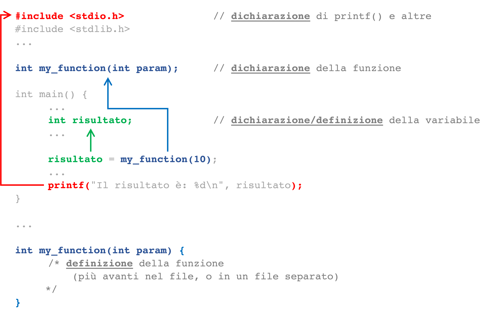
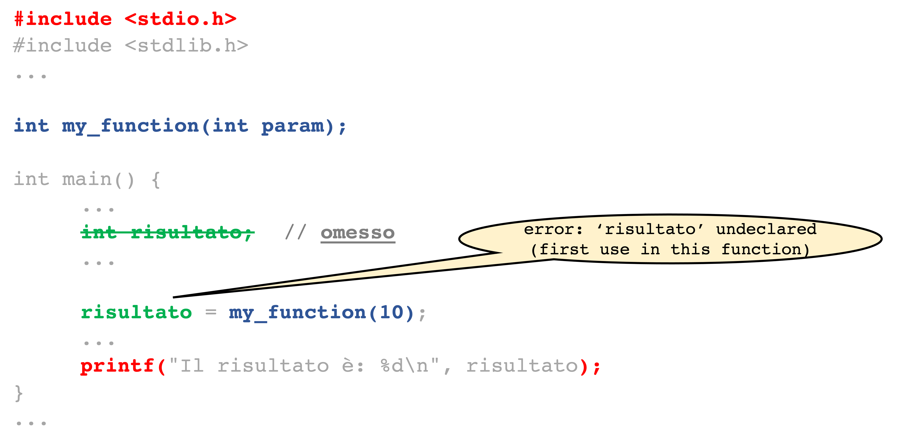
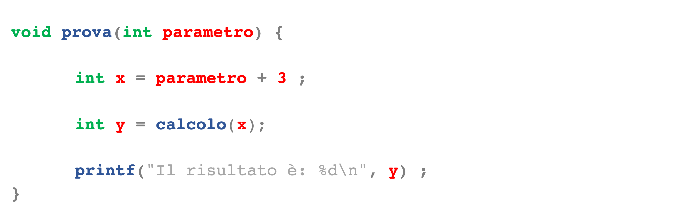
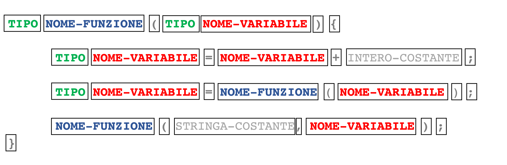
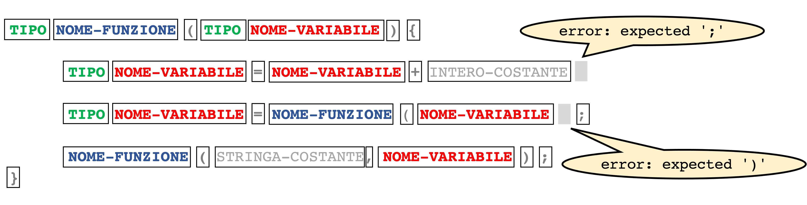
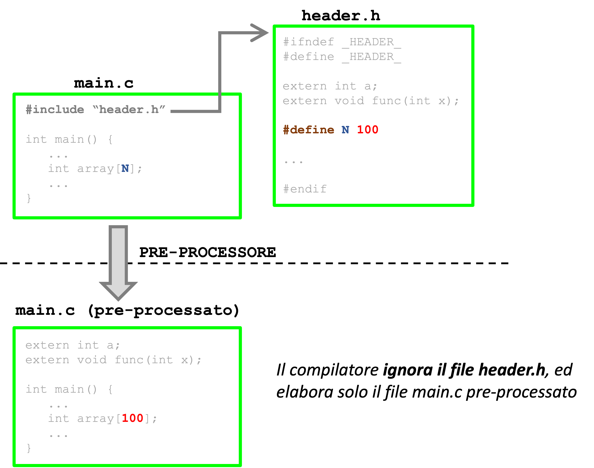
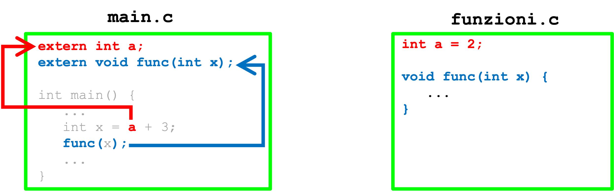
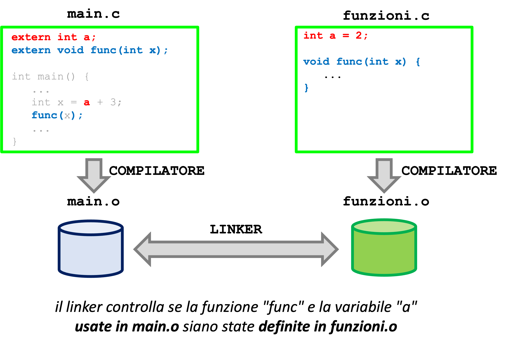
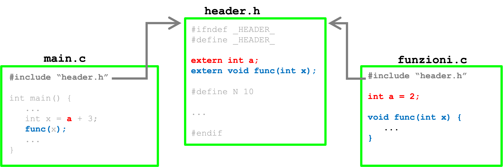
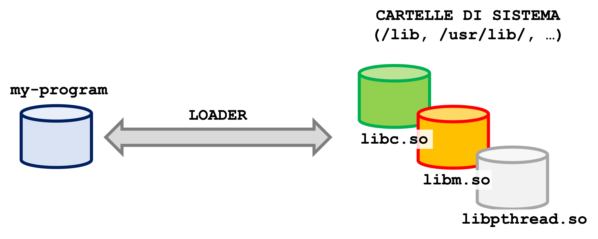

# Esercitazione: come correggere gli errori più comuni di compilazione


## Dichiarazioni

Nel linguaggio C, prima che una variabile o funzione sia usata nel programma, deve essere **preceduta da una dichiarazione**. La dichiarazione indica il tipo della variabile, o il tipo dei parametri per le funzioni.



Se si omette la dichiarazione, il compilatore segnalerà un errore. L'errore indicherà la riga in cui la variabile/funzione viene usata per la prima volta (senza essere stata prima dichiarata).




Nel caso delle funzioni, è necessario anche fornire la **definizione** del codice della funzione. La definizione può essere scritta in qualunque parte del programma (anche in un file separato).

Nel caso delle variabili locali, non è necessaria una definizione (la dichiarazione funge anche da definizione). Nel caso delle variabili globali, è necessario distinguere tra dichiarazione e definizione, come sarà spiegato più avanti.

**Esercizio**: Correggere il [programma con errori di dichiarazione, nella cartella "1-declarations/"](1-declarations)

Il compilatore segnala 3 errori:
```
find_char.c: In function ‘main’:
find_char.c:15:15: warning: implicit declaration of function ‘first_occurrence’ [-Wimplicit-function-declaration]
   15 |   int index = first_occurrence(string,character);


find_char.c:39:16: warning: implicit declaration of function ‘strlen’ [-Wimplicit-function-declaration]
   39 |   int length = strlen(string);
      |                ^~~~~~
find_char.c:2:1: note: include ‘<string.h>’ or provide a declaration of ‘strlen’


find_char.c:43:23: error: ‘lenght’ undeclared (first use in this function); did you mean ‘length’?
   43 |   for (int i = 0; i < lenght; i++)
      |                       ^~~~~~
      |                       length
```

Gli ulteriori messaggi di errore sono conseguenza di questi errori.

<details>
  <summary>Suggerimenti</summary>
  1. Per risolvere il primo errore, aggiungere la dichiarazione della funzione all'inizio del file, prima del main.
  2. Per il secondo errore, è necessario aggiungere un `#include` della libreria `string.h`.
  3. Per il terzo errore, occorre correggere il nome della variabile (deve combaciare con la dichiarazione).
</details>


## Sintassi

Il compilatore legge, una alla volta, le parole nel programma (dette "token"). Il compilatore controlla che l'ordine e il tipo delle parole rispettino le regole del linguaggio di programmazione ("sintassi").

Quando si inizia a leggere un file, il compilatore si aspetta una dichiarazione (di variabile, funzione, tipo, etc.). All'interno delle definizioni delle funzioni (ad esempio `main`), il compilatore si aspetta istruzioni di assegnazione, cicli, etc.

Considera il seguente esempio:



Il compilatore vede il programma come la seguente sequenza di token. Il compilatore legge inizialmente le parole `void`, poi `prova`, e poi la parentesi `(`. Arrivato a questo punto, il compilatore determina che il programma sta dichiarando una funzione. Da questo punto in poi, si aspetta una dichiarazione di uno o più parametri (es. `int parametro`), e poi la parentesi `)`.

Dalla presenza della parentesi `{`, il compilatore conclude che la dichiarazione è seguita dalla definizione della funzione. Al suo interno troverà due assegnazioni e una chiamata alla funzione `printf`.



Nel caso che i token non rispettino le regole del linguaggio, il compilatore segnala un errore di sintassi. Ad esempio, ogni parentesi `(` deve essere accoppiata a una parentesi `)`, ed ogni istruzione deve terminare con il punto e virgola `;`.




**Esercizio**: Risolvere il [programma con errori di sintassi, nella cartella "2-syntax/"](2-syntax)

<details>
  <summary>Suggerimenti</summary>
  1. Aggiungere il `;` mancante (va inserito alla linea precedente all'errore)
  2. Aggiungere la parentesi tonda mancante
  3. Aggiungere la virgola mancante
</details>


## Pre-processore

Il pre-processore è un software che viene chiamato dal compilatore **prima** di compilare un programma. Sostituisce le istruzioni che iniziano con `#` (es. `#include`, `#define`, etc.) con altro testo.

È analogo ad una **operazione di copia-incolla**!



Occorre prestare attenzione alla corretta sintassi delle istruzioni del preprocessore. Ad esempio, il corretto uso degli spazi, parentesi e punteggiatura in `#define`. Questi errori sono difficili da risolvere: il messaggio di errore del compilatore non mostra il codice originale (es. la macro `N`), ma il codice pre-processato (ossia il valore `100`)!

**Esercizio**: Risolvere il [programma con errore nelle direttive al pre-processore, nella cartella "3-preprocessor/"](3-preprocessor)

<details>
  <summary>Suggerimenti</summary>
  1. Rimuovere `;` dal valore indicato in `#define`
</details>


## Linking

I programmi in C sono tipicamente suddivisi su più file (nell'esempio, `main.c` e `funzioni.c`).

Un file può usare una variabile o una funzione che sono definite in un altro file. Il file utilizzatore (ad esempio `main.c`) deve almeno includere una dichiarazione delle variabili e funzioni esterne al file, precedute dalla parola `extern`.



Il compilatore elabora `main.c`, senza sollevare errori per le variabili e le funzioni esterne (pur non essendo state definite).

Nella fase di collegamento, il *linker* controllerà che le variabili e funzioni esterne usate in `main.o` siano state definite in un altro file (`funzioni.o`).



È buona norma che le definizioni siano inserite in un file "header", da includere in tutti gli altri file che usano quelle variabili o funzioni.

- *nota 1*: la parola `extern` è opzionale per le funzioni

- *nota 2*: il file header viene incluso anche in `funzioni.c` dove ci sono le definizioni. Questa inclusione non è strettamente necessaria, ma è utile. Quando il compilatore elabora `funzioni.c`, esso controllerà che le dichiarazioni siano coerenti con le definizioni (ad esempio, evita errori di distrazione nel file header).




**Esercizio**: Risolvere il [programma con errore in fase di linking, nella cartella "4-linking/"](4-linking)

<details>
  <summary>Suggerimenti</summary>
  1. Nel file `main.c`, correggere il nome della funzione nella dichiarazione esterna
</details>


## Librerie dinamiche

Il sistema operativo consente di posticipare il linking delle librerie a quando il programma verrà eseguito.

Ad esempio, le funzioni dello standard C (`printf`, `strcat`, `malloc`, e altre) sono incluse nella "libreria standard" (`libc`) che viene collegata al momento del caricamento del programma. La libreria PThreads (`libpthread`) è un altro esempio che sarà usato nel corso.



Per predisporre il caricamento delle librerie dinamiche, è necessario compilare il programma con l'opzione `-l` seguito dal suffisso del nome della libreria (es. `-lssl` per la libreria `libssl`). Fa eccezione la libreria `libc`, che è sempre collegata dinamicamente senza bisogno di indicarla.

**Esercizio**: Risolvere il [programma con errore nell'uso di librerie dinamiche, nella cartella "5-lib/"](5-lib). Consultare il manuale della funzione `sqrt` per determinare quale libreria è necessaria, e correggere il `Makefile`.

<details>
  <summary>Suggerimenti</summary>
  1. Lanciare il comando `man sqrt` per consultare il manuale della funzione `sqrt()`. Premere `q` per uscire dal manuale.
  2. Modificare la prima regola nel `Makefile`, aggiungendo l'opzione `-l` per collegare la libreria `libm`. L'opzione è indicata nel manuale.
</details>


## Crediti

Esempi tratti da:
* https://github.com/portfoliocourses/c-example-code
* https://github.com/TheAlgorithms/C/
